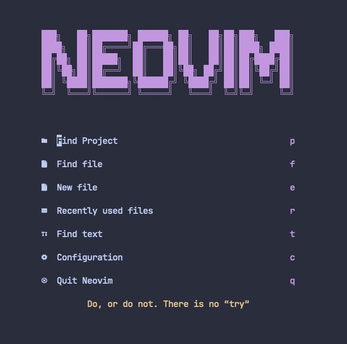

# Neovim Configuration for Easy Use

## LSP

The Language Server Protocol (LSP) is already configured for the following languages: **Golang**, **Terraform**, and **Lua**. If you need to add support for another language, you can use **Telescope** by triggering it with the leader key, which is **space** + **fh**. This allows you to search the documentation on how to set up the LSP for the language you need.

## CHATGPT Integration

In case if you're wondering on how to use **ChatGPT** inside the editor, you may need a enviroment variable with a api key that can be acquired in 
**OpenAPI** website
